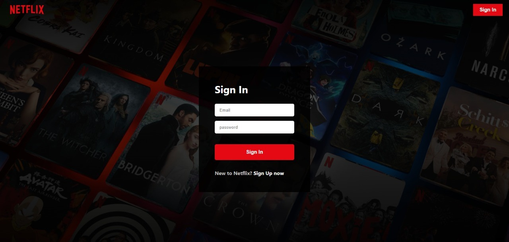
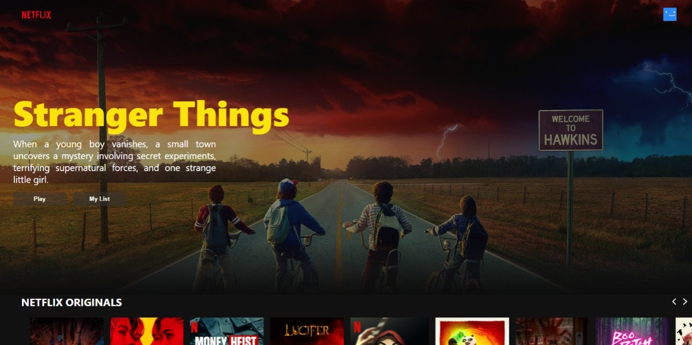
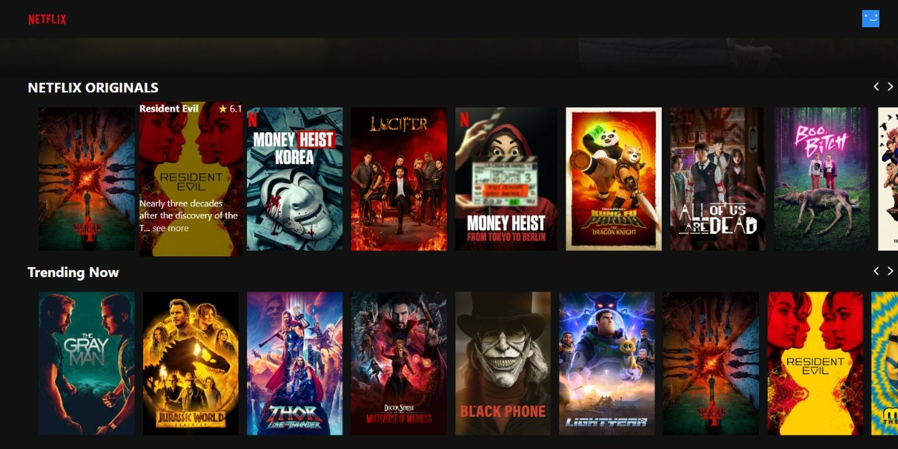
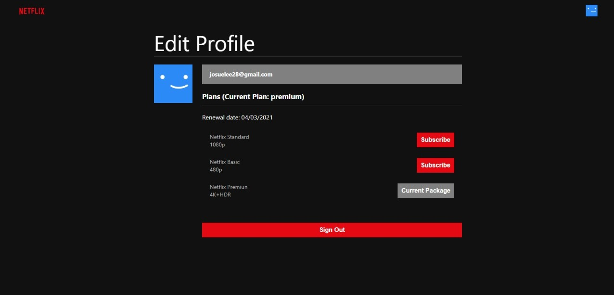

# Netflix Clone

yarn add to add node modules and libraries - yarn start to run this proyect

- React.js
- Redux
- Typescript
- React Router v6
- Firebase 9
- Firebase Auth
- TMDB API
- CSS
- BEM CSS methodology

## Preview

